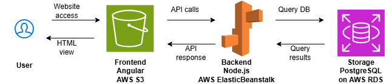

# Infrastructure Description

## 1. Architecture Overview
Udagram utilizes a decoupled, three-tier cloud architecture:
- **Frontend:** Angular/Ionic hosted on **AWS S3** (Static Website Hosting).
- **Backend:** Node.js/Express API hosted on **AWS Elastic Beanstalk**.
- **Database:** PostgreSQL managed via **AWS RDS**.
- **Storage:** **AWS S3** bucket for user media/images.

## 2. Infrastructure Components
- **Elastic Beanstalk:** API Hosting with Node.js platform
- **RDS (Postgres):** Data storage
- **S3 (Hosting):** UI delivery with public read access for static web assets
- **S3 (Media):** File storage with private access via Backend-generated Signed URLs

## 3. Deployment
- **CI/CD:** Automated via CircleCI pipeline.
